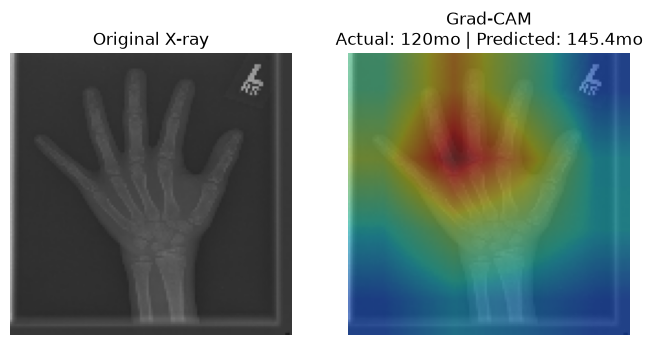

# Pediatric Bone Age Prediction from Hand X-Rays (CNN Regression)

A deep learning project that predicts a child's bone age (in months) from a
hand X-ray image, using CNNs and transfer learning. Bone age is used
clinically to detect growth disorders and plan treatment - this project
automates a task radiologists traditionally do manually by comparing X-rays
to a reference atlas.

## Problem Statement

Bone age assessment is normally done manually by radiologists comparing a
child's hand X-ray to a reference atlas (Greulich-Pyle method). This is
time-consuming and subject to inter-observer variability. This project
builds a CNN-based regression model to automate and standardize this
prediction, based on the RSNA Pediatric Bone Age Challenge dataset.

## Dataset

This project uses the **RSNA Bone Age dataset** (~12,600 hand X-ray images
with age labels in months, verified by expert radiologists).

**Dataset is NOT included in this repo** (too large for GitHub, ~10GB).
Download it yourself:

1. Go to: https://www.kaggle.com/datasets/kmader/rsna-bone-age
2. Download and extract into a `data/` folder in the project root
3. Expected structure after extraction:
```
data/
├── boneage-training-dataset/
├── boneage-training-dataset.csv
├── boneage-test-dataset/
└── boneage-test-dataset.csv
```

## Approach

1. **Baseline CNN** (`train_real.py`) - a from-scratch 3-block CNN
   (Conv2D + MaxPooling), trained on a subset of the data as a baseline.
2. **Transfer Learning** (`train_transfer.py`) - EfficientNetB0 pretrained
   on ImageNet, fine-tuned for bone age regression. Includes data
   augmentation and a two-phase training strategy (frozen base, then
   fine-tuning with a low learning rate).
3. **Explainability** - Grad-CAM visualizations showing which regions of
   the X-ray (growth plates) the model focuses on for its prediction.

## Explainability (Grad-CAM)

To verify the model is focusing on clinically relevant regions (rather than
learning spurious patterns), Grad-CAM heatmaps were generated showing which
parts of each X-ray the model attended to when making its prediction.



*The model focuses on the wrist/carpal bone region - anatomically consistent
with how radiologists assess bone maturity.*

## Results

| Model              | Validation MAE (months) |
|--------------------|--------------------------|
| Baseline CNN (from scratch)        | ~35-45                   |
| Transfer Learning (EfficientNetB0, fine-tuned) | **19.3** |

Transfer learning improved MAE by roughly 55-58% over the from-scratch
baseline. A key implementation detail: BatchNormalization layers inside the
pretrained backbone were kept frozen during fine-tuning even after
unfreezing the rest of the base model - unfreezing them destabilized
training and caused validation MAE to worsen every epoch (77+ months) until
this fix was applied.

*Note: trained on a subset (1000 images) for fast iteration on CPU. Full
dataset training would improve results further.*

## How to Run

```bash
pip install -r requirements.txt
python train_real.py        # baseline CNN
python train_transfer.py    # transfer learning model
python gradcam.py           # generate Grad-CAM explainability visualizations
```

## Tech Stack

- Python, TensorFlow/Keras
- Pandas, NumPy, scikit-learn
- EfficientNetB0 (transfer learning)

## Future Improvements

- Train on full dataset (12,600 images) rather than a subset
- Add gender as a secondary model input (bone maturity differs by gender)
- Deploy as a Streamlit web app with Grad-CAM visualization